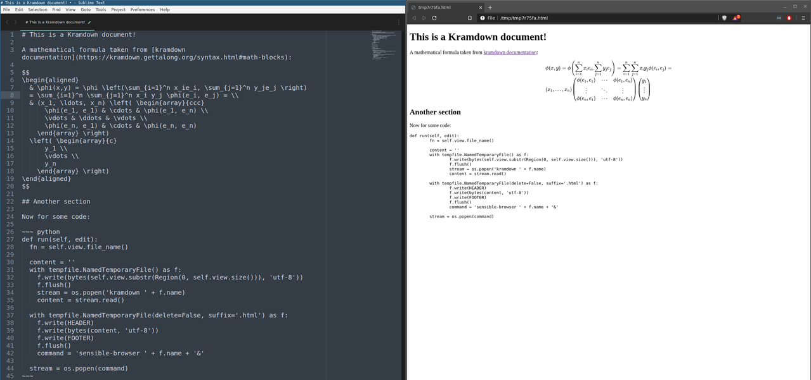

# KramdownRender

Simple Sublime Text 3 plugin making it possible to easily render currently edited
[kramdown](https://kramdown.gettalong.org/) document using a web browser.

Also works for Markdown (since kramdown is a superset).
Useful for quick live-preview of documents such as READMEs.

Integrated with [MathJax](https://www.mathjax.org/), so mathematical formulas 
written using LaTeX will render as expected.

## Dependencies

1. Kramdown - must be available under PATH as `kramdown`.
2. Web browser - must be available under PATH as `sensible-browser` (this works
	by default in most Debian-based Linux distributions).

## Installation

1. Clone the repository: 

	`$ git clone https://github.com/drabard/kramdown-sublime`

2. Enter the directory: 
	
	`$ cd kramdown-sublime`

3. Create the sublime package: 
	
	`$ ./create_package.sh`

4. Copy `KramdownRender.sublime-package` to `Installed Packages` folder in your Sublime configuration folder (below is default on Linux):

	`$ cp KramdownRender.sublime-package ~/.config/sublime-text-3/Installed\ Packages`

## Usage

Press the associated key combination (default: `Ctrl + Alt + Shift + m`) 
while editing a buffer in ST3. It is going to be interpreted as kramdown and 
rendered in your web browser.

